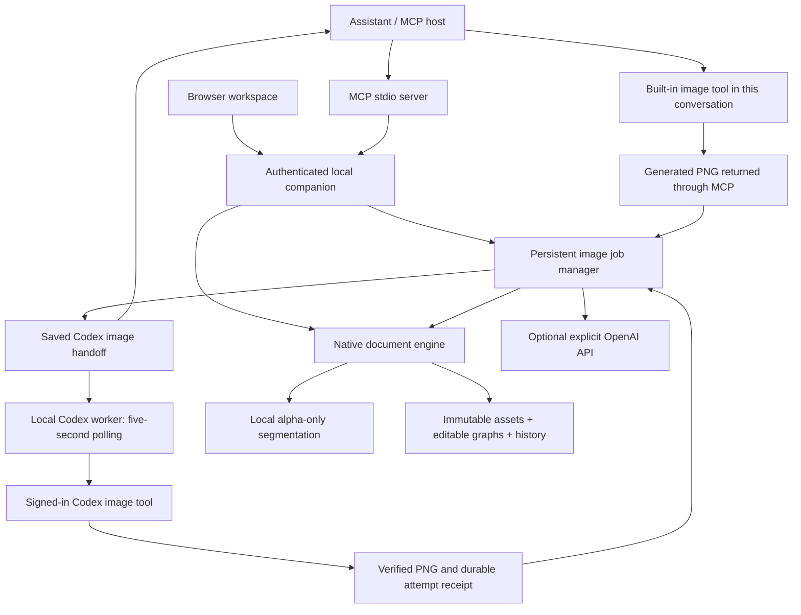

# Prism Studio architecture

Prism is an assistant-controlled editing workspace. MCP supplies real inspection and editing tools; the connected assistant plans their use. The browser is a second client of the same local companion. There is no simulated chat planner or keyword-to-edit shortcut.

## Standalone engine

The product roadmap targets native feature parity and requires no Photoshop installation. The earlier optional Photoshop bridge (UXP plugin) has been removed; the native engine is the only backend.

Native documents stay authoritative in Prism. They contain an ordered layer graph, immutable raster assets, editable text/vector/gradient/adjustment settings, masks and history states. A command validates its arguments and document revision, edits a cloned graph and persists the new state atomically. Transactions group supported commands into one history step and discard graph changes on failure.

Aligned Clone/Heal is a small client session over the existing explicit-source stroke API. It retains document-space coordinates, never sampled image buffers. An epoch-owned ticket captures each gesture and reserves its exact accepted revision before App publishes metadata; separate gates control delayed preview and completion. Failed or abandoned replies cannot erase a replacement sample. The ordinary polling path reconciles uncertain committed work without replay. Native pixel, persistence and sampling-scope behavior is unchanged. See [coordinate and result-ownership contract](CLONE_ALIGNMENT_DESIGN.md).

Reusable recipes store typed metadata edits with explicit target slots. Their validation and application share staged native mutations and the complete prospective history-size check; application is one revision-bound commit. Independently positioned additional masks retain their source frame in a validated wrapper. Shared coverage helpers keep rendering, protection, inspection, selection loading and PSD consistent. Transactions containing retained masks also validate intermediate graphs before later pixel operations. See [recipes](EDIT_RECIPES.md) and [mask positioning](MASK_POSITION.md).

The engine implements its own algorithms, not proprietary Adobe algorithms or guaranteed identical file semantics. [Bounded PSD import](PSD_IMPORT.md) and [strict layered PSD export](PSD_EXPORT.md) support declared flat raster subsets with explicit reports; full PSD/PSB fidelity, RAW, Smart Objects and higher-precision professional color remain future milestones. See the [roadmap](ROADMAP.md) and [sourced feature inventory](PHOTOSHOP_TOOL_INVENTORY.md).

Explicit source-filter baking evaluates current working RGB with source/cutout alpha, restores original working alpha, and retains masks and geometry. It preserves exact current composition for admitted graphs; active stacks above earlier protected content reject because their contextual unfiltered restoration cannot be baked. Source, output and deduplicated-asset reads are bounded before allocation. Private-file PNG staging avoids Sharp's whole-buffer stream behavior. Complete bake-containing transactions share new-asset ownership through commit, including later pixel edits. See [baking scope and phase ledger](FILTER_BAKING.md).

Source Gaussian Blur and RGB Sharpen use a separate integer alpha-weighted algorithm, leaving global Sharp adjustment behavior unchanged. Four Uint32 horizontal sums per cached source pixel feed exact Number vertical sums; clamped rational half-up rounding is proved independent of BigInt. Only the candidate escapes the rolling-cache helper. Source-filter work depends on kernel span, and shared rendering takes the maximum of spatial cache/candidate and geometry phases. Baking adds the same maximum active ring to its source-filter phase before input reads. See [source spatial arithmetic and limits](SPATIAL_LAYER_FILTERS_DESIGN.md).

The source-only Unsharp Mask family reuses those exact Gaussian sums but has independent Amount, sigma and per-RGB-channel Threshold parameters. Source kind/range/parameter normalization is separate from global adjustment tables. Its threshold comparison is exact; statically safe reduced fractions use integer rounding, while other amounts use a conservative half-boundary guard and exact BigInt recomputation. It adds no extra image plane or per-pixel retained state. Uniform work admission covers the measured all-channel fallback case, and metadata identities avoid the ring while retaining active-filter guards. See [Unsharp algorithm, compatibility and ledger](UNSHARP_MASK_DESIGN.md).

Seeded source Add Noise uses a stateless uint32 counter map, a defined Uniform distribution and a certified discrete Gaussian table. Samples depend on source coordinates/channel and the saved seed, independently of graph IDs and alpha skipping. Exact integer arithmetic produces rounded RGB candidates without changing alpha. One candidate buffer and bounded pixel batches avoid a random field or per-pixel state array. The lazily initialized private 4096-byte table is a persistent shared reservation, added after the graph's retained peak and to every Bake phase; it is separate from sequential spatial caches. Metadata admission does not initialize it. See [noise algorithm, certification and ledger](NOISE_FILTER_DESIGN.md).

Source High Pass reuses the exact alpha-weighted sums to produce a once-rounded gray-centered residual, without an intermediate rounded blur. Its bounded integer numerator stays within exact Number range. Sigma zero fills visible candidate RGB with 128 and preserves alpha/hidden RGB; it remains structurally active and enters the existing blend stage. The dedicated policy is independent of other source spatial markers. Positive entries share the existing ring/work ledger, with no extra full-image plane. See [High Pass arithmetic and validation](HIGH_PASS_DESIGN.md).

Local Shadows / Highlights uses a quantized encoded-RGB tone and exact alpha-weighted neighborhood. A two-channel row cache avoids an extra full-image tone plane; a bounded 512-entry table compiles exact tone weights before the per-pixel rational curve. Source alpha and hidden RGB remain untouched, and the completed effect mask follows the full neighborhood calculation. The shared sequential-cache maximum, masked-source admission and each Bake phase include the local cache. Work admission distinguishes zero sigma, positive sigma and both-zero Amounts; table setup yields separately every 64 entries. See [local-tone arithmetic and resource bounds](LOCAL_SHADOWS_HIGHLIGHTS_DESIGN.md).

Individual filter blending is separate from whole-layer compositing. Existing byte candidates blend with current source RGB before filter opacity; source alpha is never composited again. A source-only helper gives 20 modes exact rational byte/opacity rounding with a proven Number fast path and guarded BigInt fallback, while five modes retain explicitly defined native floating formulas. Normal preserves its existing branch and serialization. Identity candidates still enter nonnormal blending without unnecessary rings or noise sampling; each active nonnormal mode adds 40 weighted visits and uses at most 16,384-pixel batches. The existing candidate/ring/table ledger remains sufficient. See [filter blending design](FILTER_BLEND_DESIGN.md).

A source filter effect mask runs after the complete ordered stack and before geometry, mixing original/filtered RGB with one effective alpha8 weight. It neither changes alpha nor restricts a spatial filter's input neighborhood. Masked stacks persist in a strict versioned wrapper; public documents explicitly project an entry array plus read-only mask metadata. Exact integer-copy selection capture tracks the surviving source domain through every crop/translation, with separate bounded capture work. Async bitmap preparation preserves the existing feather result. Mask and spatial scratch occupy separate phases, while graph validation also admits the full direct source envelope before image reads. Bake consumes the filtered mask result and retains source/cutout alpha and later layer coverage. Source-frame grayscale inspection reads no RGB. See [mask representation, arithmetic and admission](FILTER_MASK_DESIGN.md).

Optional Smooth Curves shares an environment-neutral 256-byte PCHIP compiler between the native candidate and the client plot. Bounded tangent-to-secant ratios handle arbitrary finite point spacing without overflowing slopes. Integer knots are pinned; the old Linear loop stays literal. No source/global alpha policy is changed. Canonical Linear recipes inject an explicit transient reset only during adjustment staging, retaining their saved bodies and hashes. See [numeric and compatibility details](SMOOTH_CURVES_DESIGN.md).

Independent Curves banks retain the legacy single representation and add explicit Master/Red/Green/Blue records. A shared normalizer handles nested retention and deliberate representation replacement. Master is quantized before component lookup, with one blend/opacity stage for the resulting candidate. Private compilation peaks at 1,280 named table bytes and retains 768 bytes during mapping. Source tables join sequential cache maxima; global banked adjustments add one conservative graph/Distort reserve. No persistent cache or asset dependency is introduced. Complete bank recipes reset every bank; legacy recipe staging supplies a transient single-mode reset without changing saved hashes. See [bank numeric, lifetime and compatibility design](CURVES_BANKS_DESIGN.md).

Native Selective Color partitions each input RGB byte tuple into nine integer memberships summing to255, compiles36 centipercent controls into27 additive CMY+K coefficients, and performs one bounded exact half-up result per channel. Relative and Absolute share original-input range weights; all-zero metadata selects the one-visit identity path while nonzero cancellation retains12-visit work. No additional image-sized cache is introduced. Both source/global dispatch skip transparent RGB, preserving alpha; existing source blend, complete-stack mask, geometry and protection remain downstream. See [the numeric and resource design](SELECTIVE_COLOR_DESIGN.md).

Native targeted Hue / Saturation compiles 21 centi-unit controls and combines Master with fixed input-hue triangles. Hue/Saturation use hue-normalized weights, named Lightness uses chroma attenuation, and positive saturation scales current HSL saturation. Bounded exact integer setup feeds a declared binary64 RGB conversion; identity, gray and endpoint branches are pinned. Both dispatch paths preserve alpha and hidden RGB, with no extra image plane or LUT asset. Computing source work32 and zero-control work1 retain existing blend/mask admission and cooperative yielding. See [evaluation and numeric policy](TARGETED_HSL_EVALUATION.md).

Imported Color Lookup retains immutable original `.cube` assets separately from raster and PSD assets. A common typed-reference walker validates every use, including disabled entries and retained history. Atomic import/replacement preflights the queued target, revision, prospective history and graph resources before publishing an owned asset; failure removes only newly owned files. Strict decimal-domain validation precedes Float64 table allocation. Each active occurrence is read, hashed, parsed and compiled independently, then released before the next entry. No compiled table persists across renders. Alpha and hidden RGB remain exact. The stronger active-LUT graph ledger jointly includes content, group/clipping surfaces, masks and lookup preparation; it does not claim to bound all codec/style internals or total RSS. See [the typed assets, grammar, numerical policy and allocation ledger](COLOR_LOOKUP_DESIGN.md).

Native Photo Filter compiles a filter color and centipercent density into integer transmission coefficients. Optional encoded-luma restoration and shared chroma fitting produce exact half-up RGB8 with a proved safe Number ratio bound; there is no intermediate channel quantization or per-pixel BigInt. Alpha and hidden RGB remain unchanged. Computing source work16 and metadata-identity work1 join existing blend/mask admission without a new cache. Strict own-data validation runs before transaction snapshots, preventing accessor evaluation on this native parameter path. Both source/global loops yield within16,384 pixel visits. See [arithmetic, endpoints and measured production work](PHOTO_FILTER_DESIGN.md).

Global adjustment RGB loops yield after at most65,536 pixel visits for admitted widths; previously cooperative color-mapping families retain a tighter row cadence where applicable. Pixel formulas and per-kind hidden-RGB policies are unchanged. The command queue keeps exports and later mutations ordered throughout these yields. This bound excludes allocation, mask setup, other compositing and codecs. See [responsiveness evidence](GLOBAL_ADJUSTMENT_RESPONSIVENESS.md).

## Original pixels and subject protection

Imported original files are retained byte-for-byte. A normalized 8-bit sRGB working image is a separate asset. The local BiRefNet process receives an image and returns alpha coverage only. Extraction stores that alpha separately; it never reconstructs the source RGB. Brush or selection-based repair changes only alpha and can restore omitted source details.

Placement fits the complete visible source bounds proportionally into a target rectangle. Resampling changes working samples, as any resize must, while retaining the original asset. Outside outlines do not repaint subject pixels. Protected layers reject destructive painting, changed opacity and stretching until explicitly unprotected. Masks, translations and proportional transforms remain editable.

Document resizing optionally retains a strict `resample` stage for nearest, cubic or Mitchell, while omitted/default Lanczos3 keeps the exact legacy `resize` path. The native nearest implementation copies pixel-center RGBA samples without premultiplication; photographic kernels follow installed Sharp reduction/cubic-enlargement behavior. Content geometry uses the selected method, and document-coordinate masks/selections/guides use a separate ordinary resize descriptor. Old readers reject the new type. Source assets remain unchanged, existing resource estimators include all intermediate stage dimensions, and positioned-mask/proportional-protection guards remain authoritative. See [resize contract](RESAMPLING.md).

Four-corner Distort retains a strict fixed-frame projective stage in the geometry list. Exact identity/integer copies retain all RGBA bytes; other admitted quads use conditioned inverse mapping and alpha-weighted bilinear sampling with transparent fringes. Source filtering and its effect mask finish before geometry; document masks remain fixed. Every retained stage enters its own work ledger. Any graph containing Distort also admits a combined named-buffer envelope across all content leaves, root/protection buffers, global group/clipping reserves, bitmap masks and shared noise; PSD preparation adds retained export planes. Legacy-only admission is unchanged. See [numerical contract and buffer lifetimes](PERSPECTIVE_TRANSFORM_DESIGN.md).

Protection is enforced during provider-mask capture, result installation and native compositing. Generated layers are clipped against current protected layers beneath them. This remains true after people move or generated layers are reordered. Generated backgrounds below people blend normally through their original alpha edges. Model obedience is never the only protection mechanism.

## Image generation lifecycle

A generation request has a stable caller-supplied retry ID. Its saved fingerprint prevents changed requests from silently reusing that ID. The default provider is `codex`: an `awaiting_image` receipt stores the prompt and edit snapshot. A supervised local worker polls every5000ms and runs one signed-in Codex image attempt at a time. It returns a validated PNG through the same manager completion path used by localhost/MCP; the model receives no localhost bearer token or optional API key. `PRISM_CODEX_BIN` overrides the executable and `PRISM_CODEX_WORKER=0` disables the normal launcher worker. `createCompanion` remains disabled by default and accepts an injected adapter for tests.

New automatic jobs persist `automation:{state:'queued'}` at initial publication. Queued, generating and returning requests refuse public manual handoff/completion, closing both orderings of the manual/worker race. Legacy unmarked handoffs remain manual and are never adopted. Under the manager's serial lock the worker changes queued to generating with a unique durable attempt ID **before** invoking the adapter. Startup converts uncertain generating attempts to interrupted, never automatic regeneration. The adapter receives materialized immutable input/mask references and returns only PNG bytes. The worker persists those bytes and a returning hash before installation; bounded no-follow, same-descriptor SHA-256 reads verify references and returning output. Saved returning output can be retried exactly without launching Codex again. Public job metadata exposes only the automation state and sanitized message, not attempt ownership fields or artifact paths.

Jobs persist as awaiting_image, queued, running, ready, succeeded, failed or cancelled. At most six requests may be pending; at most one explicit API request runs at once. Storage reservations apply before accepting work. Codex handoffs persist through restart. Identical completion bytes return the existing receipt; different bytes cannot overwrite it.

Editing captures the document revision, flattened PNG and edit mask. Generated output is validated, retained and installed as a separate layer. A revision conflict keeps the result for explicit application at the new revision; it does not generate another image. Captured selection edits cannot be applied to different canvas dimensions. Restarted in-flight API requests become interrupted and are never automatically retried.

Cancellation records intent immediately, including while completion waits in the serialized queue, aborts the active local adapter and prevents later installation. Shutdown closes the worker before the generation manager, including aborting an already-running application. Per-attempt temporary references are removed; uncertain attempts retain receipts and never regenerate automatically. An image request already submitted may still consume Codex usage. The optional API route may still bill requests it already received; API quota and model access remain account-side conditions. The browser receives job metadata, worker readiness and previews, never a provider key. Only explicit API status checks read API configuration.

## Local runtime boundaries

The companion binds to loopback and validates Host, Origin and authentication. MCP uses stdio plus authenticated local HTTP. The image provider has fixed HTTPS endpoints and bounded PNG responses. No request accepts executable scripts.

Segmentation runs in an isolated Python virtual environment using ONNX Runtime CPU. The child receives a minimal environment without provider credentials, a fixed script and model path, bounded framed PNG input and emits only bounded raw alpha. A verified model is reused; timeouts and shutdown terminate the actual process. Setup downloads dependencies, while inference itself is offline.

Native limits currently include 8,192 pixels per axis, 24 megapixels, 64 layers, 100 retained history states and 16 MiB of project metadata. Rendering is full-frame. The next engine milestone is tiled processing with caches and explicit memory budgets, followed by higher precision, color management and staged file-format compatibility.

Detailed selections and masks use canonical run-length records or exact framed alpha8 assets under `framed-raw-alpha8-v1`. The shared typed asset walker includes current and historical mask slots and rejects conflicting asset kinds/frames. Private asynchronous preparation verifies bytes and snapshots coverage metadata before rendering; all producers use adaptive operation-owned publication with rollback. Composite-channel load/preview measures the final rendered image using the explicit `composite-byte-alpha-v1` byte policy. The joint named-buffer/work ledger covers relevant masks, source/global filters, group contexts and outside effects before reads; canvas projection includes the transformed guides and final mask frames before serial publication. See [the complete consumer/resource design](DENSE_MASK_DESIGN.md).

## Verification and release boundaries

Tests cover original-byte retention, mask boundaries, hostile model output, revisions, rollback, restart, cancellation, MCP round trips and browser controls. A real local-model verification also checks every source RGB pixel and reopening. Automatic mask quality still needs visual inspection; the public test photograph exposed an omitted held accessory, which selection-based alpha repair addresses.

The [implementation status](IMPLEMENTATION_STATUS.md) records which results are simulated, locally verified or still unverified. A configured API key does not establish available quota, and a built Photoshop plugin does not establish a connected, tested Photoshop installation.
